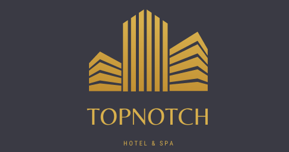
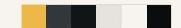
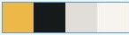

___
# TOP NOTCH HOTEL AND SPA
## 1ST MILESTONE PROJECT FOR CODE INSTITUTE – A USER-CENTRIC STATIC WEBSITE

[VIEW THE LIVE PROJECT HERE](..#)

---
## INTRO
---
 This is a site for a fictional Birmingham-based new luxury hotel looking for an online presence. The site gives visitors and users an overview of services offered by the hotel with a strong reliance on captivating images 

--- 
## BRIEF SITE DEMO

---
## TYPICAL CUSTOMERS

* Couple celebrating an anniversary/milestone in their relationship.
* Customer who received a stay as a gift.
* Family looking for a getaway like no other
* Corporate users- overnight stay for a business meeting
	* Ideal location for a corporate retreat.
* Destination location for nights out with public access to the bars and restaurants on site.

---
## USER STORIES
* As a first-time visitor I want to see what type of rooms are available so I can request a booking
* As a user I want to see if there are bars or restaurants open to the public so I can book a table
* As a user I want to find contact details so I can call or request a call back
* As a corporate user I want to know if hotel has conference facilities so I can request more information
* As an event organiser I want to know if hotel caters for social events like weddings or birthdays etc

---
## CLIENT STORIES

* The client wants a unique looking website that suggests luxury and comfort with no expenses spared
* The clients want a search engine optimised site that ranks amongst top search results for the area
* The client desires high user engagement in the request for call-backs or more information.
* The client desires measurable conversion rate of visitors to the site versus sign ups for the newsletter and requests for call back
---

## DESIGN PHILOSOPHY
Overall design philosophy is influence mainly by the user and client stories and by the fact that
the hotel is aimed at the high-end market, ideally customers are more influenced by the uniqueness of the experience rather than the cost. 
Hence the choice of colour scheme, layout, and typography.

---
## COLOUR SCHEME AND TYPOGRAPHY

## Fonts: 

Italiana paired with Roboto imported from [Google Fonts](https://fonts.google.com/)

---
## WIREFRAMES
Initial wireframes were hand drawn then digitised using Balsamiq.

---

## TECH STACK

HTML5, CSS3, BOOTSTRAP5, JAVASCRIPT, FONT AWESOME, POPPER JS, GITHUB, GITPOD, 

---

## CODE CREDITS

Code for embeded google map obtined as is from Google Maps

---

## MEDIA CREDITS
Logo was created using free templates from canva.com
Most icons were from Font Awesome except for a couple from Google Icons 
All images were from [pexels.com](https://www.pexels.com/)

Individual credits: 
	
Photo by Kyle Roxas from Pexels

Photo by Pixabay from Pexels

Photo by Yan Krukov from Pexels

Photo by Anete Lusina from Pexels

Photo by RODNAE Productions from Pexels

Photo by cottonbro from Pexels

Photo by Amelia Hallsworth from Pexels

Photo by Enric Cruz López from Pexels

Photo by Christina Morillo from Pexels

Photo by Jep Gambardella from Pexels

Photo by Tembela Bohle from Pexels

Photo by Terje Sollie from Pexels

Photo by Amelia Hallsworth from Pexels

Photo by Picography from Pexels

Photo by Kelly L from Pexels

---

## CODE DEVELOPMENT AND DEPLOYMENT

Code was developed using VSCode initially for conceptual purposes.

Main development was done using GitHub and Gitpod via the Code Institute Template.

As stated earlier this is a fictional site developed as part of an educational exercise.

It is hosted on GitHub pages and the site will be continually updated upon further code commits.

The repository is publicly available and can be cloned directly by using the fork tool on GitHub

---

## TESTING

Testing was done on a continuous basis using the live preview on Gitpod coupled with developer tools on the chrome browser. 

It was pretty much possible to get live feedback on every line of code or html element or styling. 

Additional testing was done by submitting code for peer-to-peer review on THE Code Institute Slack channel.

---
## FURTHER TESTING

SITE RESPONSIVENESS : [amiresponsive.co.uk](https://amiresponsive.co.uk/)

CODE VALIDATION :

* [HTML:](https://validator.w3.org/)

* [CSS:](https://jigsaw.w3.org/css-validator/)

* [Accessibility:](https://wave.webaim.org/)

* [Performance:](https://developers.google.com/web/tools/lighthouse)

---

## PROBLEMS AND ISSUES
Image sizes for the carousel were different sizes which resulted in juddering effect while the images were scrolled through as every element on the homepage had to be repositioned
-	This issue was resolved by putting every image through an [image resizer](http://www.simpleimageresizer.com/)
- Had trouble with images stretching on mobile and tablet views but using percentages for sizing resolved that.

---

## UPCOMING FEATURES

The minimum acceptable product for the client was a static website which gives users as much information as they need but expects more dynamic and interactive features for future iterations.

-	Direct booking from the site
-	Handling credit card payments
-	Realtime room availability
-	etc

